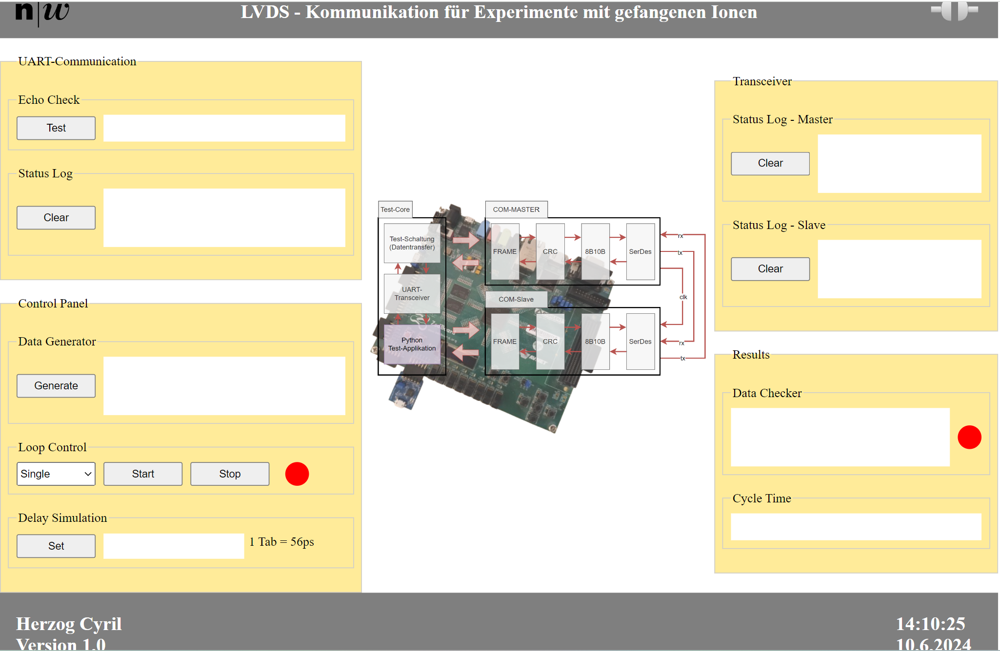

# Testsystem für LVDS - Transceiver

## Abstract

Im Rahmen eines Auftrages zur Leistungssteigerung der Übertragungsrate in einem verteilten Embedded-System, wird ein neuer Transceiver auf einem FPGA entwickelt. Dabei wird neben einer höheren Datenrate auch eine selbstjustierende Abstimmung zwischen der Daten - und Taktleitung erwartet. Um die Funktionalitäten zu Prüfen, wird zusätzlich ein Test-Core entwickelt, welcher eingehende Kommandos via UART-Protokoll interpretiert. Das Bilden und Steuern dieser Kommandos wird von einer Client,-Server-Applikation getätigt welche in diesem Dokument beschrieben wird. Dabei ist der Server ein RaspberryPi welcher mit einer UART-Kommunikation Kommandos und Datenwerte mit dem FPGA (Test-Core) austauscht. Das Anstossen von Serverseitigen Befehlssequenzen erfolgt durch Benutzereingaben am HMI (Client).      

---

## Funktionsbeschreibung

### Verbindungsaufbau

Für den Verbindungsaufbau muss das Stecker-Icon rechts neben der Überschrift gedrückt werden. Bei erfolgreichem Kommunikationsaufbau wird die Steckverbindung symbolisch geschlossen und mit einer grünen Umrandung signalisiert. Sollte die Kommunikation Systemseitig unterbrochen werden, so stellt sich ein roter Hintergrund ein. Die Kommunikation kann jederzeit durch ancklicken des Icons aufgebaut, respektive getrennt werden.

### UART-Kommunikation

Dieses Benutzerpanel dient zum Test und Überwachen des Datentransfers über die Uart Schnittstelle. Durch drücken des Tasters "Test" wird ein zufälliges Byte erzeugt, welches vom Test-Core zurückgeschickt wird. Ein passender Vergleich bestätigt die Verbindung, welche am Textfeld ausgegeben wird. Das LOG-Fenster protokolliert alle Transferaufträge mit Datum und Uhrzeit. 

### Control - Panel

Der Datengenerator lässt 56 zufällige bytes auf dem Server erzeugen und sendet diese an das FPGA-Testsytsem. Dabei werden die erzeugten Daten zum direkten Verlgeich an die Client-Anwendung geshcickt und im Textfeld angezeigt. Das Datenpaket wird in einem RAM-Block innerhalb des Testsystems gesichert. 

Durch Drücken von Loop-Start werden die Daten aus dem Ram-Block über die Transceiver zu einem Ziel-RAM-Block übertragen. Dieser Vorgang Widerholt sich so lange, bis die Loop-Stop Taste gedrückt wird. Anschliessend werden die Datenpakete aus dem Ziel-RAM-Block herausgelesen und im Bereich Resultate auf dem Client zusammen ausgegeben. Weiter folgt im Feld der Resultate (Rechte Seite) die Anzahl der Zyklen, welche ein Durchlauf vom Start-RAM in den Ziel-RAM beschreibt. Dieser Wert sowie ein Vergleich der Generierten und Empfangenen Datenwerten sollen die Funktionalität bestätigen. Die gezählten Zyklen werden dabei mit dem Schaltungssimulationswert verglichen um die Taktrate zu bestätigen. 

### Transceiver

Jeder der beiden Transceiver generiert Status-Meldungen, welche im LOG-Fenster mit Uhrzeit angegeben werden können. 

